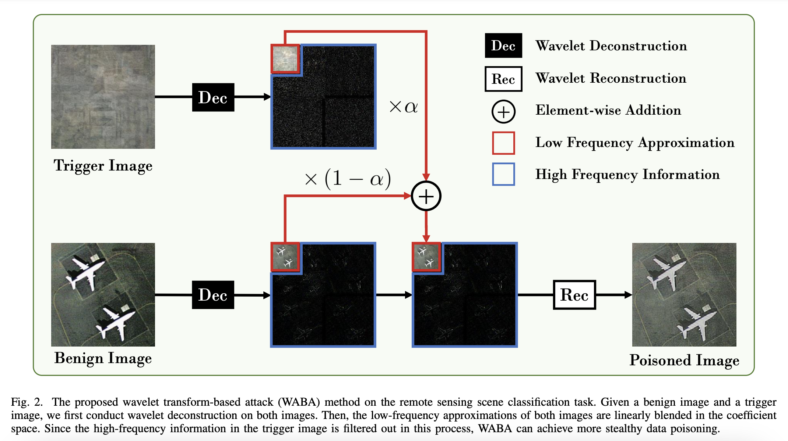

<h1 align="center">Backdoor Attacks for Remote Sensing Data with Wavelet Transform</h1>

<h3 align="center"> <a href="https://www.linkedin.com/in/nikolaus-dr%C3%A4ger-20826b174/">Nikolaus Dräger</a>, <a href="https://yonghaoxu.github.io/">Yonghao Xu</a>, <a href="https://www.ai4rs.com/">Pedram Ghamisi</a></h3>
<br

*This research has been conducted at the [Institute of Advanced Research in Artificial Intelligence (IARAI)](https://www.iarai.ac.at/).*
    
This is the official PyTorch implementation of the paper **[Backdoor Attacks for Remote Sensing Data with Wavelet Transform](https://arxiv.org/abs/2211.08044)**.
    

### Implementation
Coming soon!
